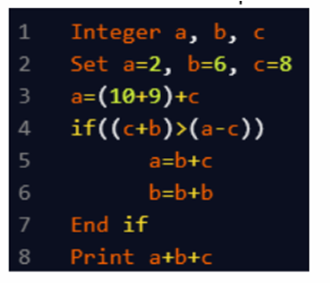

A. 23
B. 41
C. 48
D. 58

Approach: 
    a = 2, b = 6, c = 8

    a = (10 + 9) + c = 19 + 8 = 27

    Check: (c + b) > (a - c) → 14 > 19 → False → skip if block

    Final: a + b + c = 27 + 6 + 8 = 41

Answer: 41