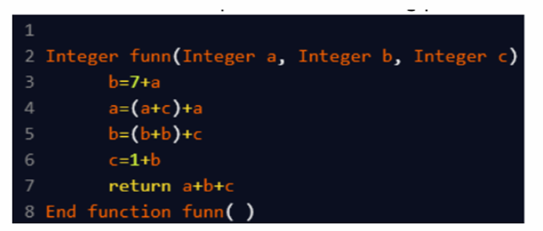

A. 59
B. 68
C. 70
D. 39

Approach: 
 a=0, b=2, c=10

b = 7 + a      → 7  
a = (a + c) + a → (0 + 10) + 0 = 10  
b = (b + b) + c → (7 + 7) + 10 = 24  
c = 1 + b      → 1 + 24 = 25  

return a + b + c → 10 + 24 + 25 = 59

Final Answer: A. 59