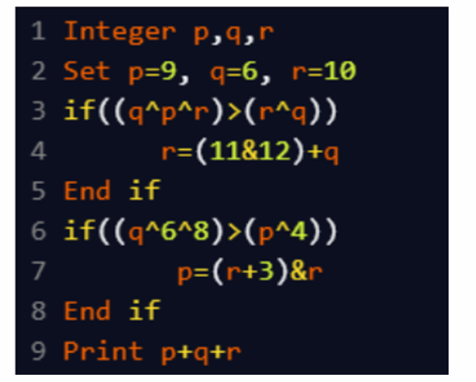

A. 20
B. 27
C. 25
D. 36

Approach: 
p = 9, q = 6, r = 10

(q ^ p ^ r) = 5, (r ^ q) = 12 → 5 > 12 → False → skip

(q ^ 6 ^ 8) = 8, (p ^ 4) = 13 → 8 > 13 → False → skip

p = 9, q = 6, r = 10

p + q + r = 25

Final Answer: C. 25
