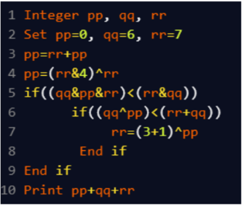

A. 29
B. 18
C. 10
D. 16

Approach:
pp = 0, qq = 6, rr = 7

pp = rr + pp = 7 + 0 = 7  
pp = (rr & 4) ^ rr = (7 & 4) ^ 7 = 4 ^ 7 = 3

(qq & pp & rr) < (rr & qq)
→ (6 & 3 & 7) = 2, (7 & 6) = 6 → 2 < 6 → True

(qq ^ pp) < (rr + qq)
→ 6 ^ 3 = 5, 7 + 6 = 13 → 5 < 13 → True

rr = (3 + 1) ^ pp = 4 ^ 3 = 7

pp = 3, qq = 6, rr = 7  
3 + 6 + 7 = 16

Final Answer: D. 16
