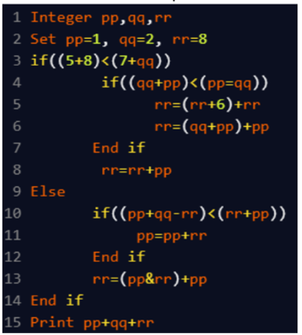

A. 35
B. 49
C. 19
D. 28

Approach:
pp = 1, qq = 2, rr = 8

(5 + 8) < (7 + qq) → 13 < 9 → False → else block runs

(pp + qq - rr) < (rr + pp) → -5 < 9 → True

pp = pp + rr = 1 + 8 = 9  
rr = (pp & rr) + pp = (9 & 8) + 9 = 8 + 9 = 17

pp = 9, qq = 2, rr = 17  
pp + qq + rr = 9 + 2 + 17 = 28

Final Answer: D. 28
