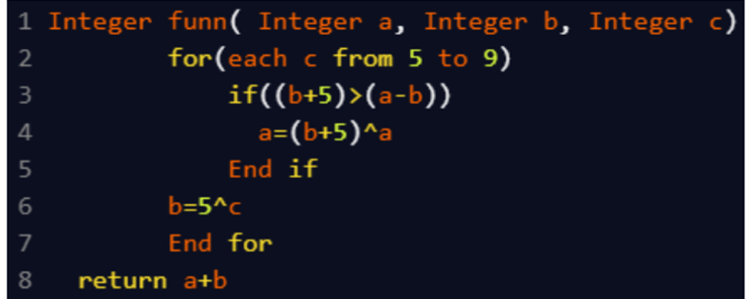

A. 26
B. 55
C. 40
D. 44

`funN(4, 7, 3)`

Initial values:
- a = 4
- b = 7
- c = 3 (note: this `c` is unused as the loop runs `c = 5 to 9`)

---

**Loop Execution:**

#### c = 5
- Condition: (b + 5) > (a - b) → (7 + 5) > (4 - 7) → 12 > -3 ✅
  - a = (b + 5) ^ a = 12 ^ 4 = 8
- b = 5 ^ 5 = 0

#### c = 6
- Condition: (b + 5) > (a - b) → (0 + 5) > (8 - 0) → 5 > 8 ❌
- b = 5 ^ 6 = 3

#### c = 7
- Condition: (b + 5) > (a - b) → (3 + 5) > (8 - 3) → 8 > 5 ✅
  - a = (b + 5) ^ a = 8 ^ 8 = 0
- b = 5 ^ 7 = 2

#### c = 8
- Condition: (b + 5) > (a - b) → (2 + 5) > (0 - 2) → 7 > -2 ✅
  - a = (b + 5) ^ a = 7 ^ 0 = 7
- b = 5 ^ 8 = 13

#### c = 9
- Condition: (b + 5) > (a - b) → (13 + 5) > (7 - 13) → 18 > -6 ✅
  - a = (b + 5) ^ a = 18 ^ 7 = 21
- b = 5 ^ 9 = 12

---

### Final Result:
- a = 21
- b = 12
- Return: `a + b = 21 + 12 = 33`
