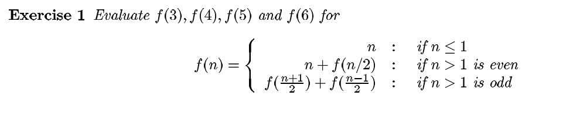

f(3)=f(4/2)+f(2/2)=f(2)+f(1)
f(2)=2+f(2/2)=2+1=3
f(3)=3+1=4

f(4) = 4 + f(4/2) = 4 + f(2)
f(2) = 2 + f(2/2) = 2 + f(1) = 2 + 1 =3
f(4) = 4 + 3 = 7

f(6) = 6 + f(6/2) = 6 + f(3)
f(3) = 4 (from above)
f(6) = 6 + 4 = 10

