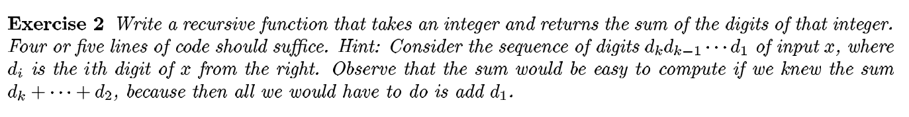

sum_digits(x):
    if x == 0
        return 0
    return (x % 10) + sum_digits(x / 10)

Dry Run: 

sum_digits(1234)
= 4 + sum_digits(123)
= 4 + 3 + sum_digits(12)
= 4 + 3 + 2 + sum_digits(1)
= 4 + 3 + 2 + 1 + sum_digits(0)
= 4 + 3 + 2 + 1 + 0 = 10