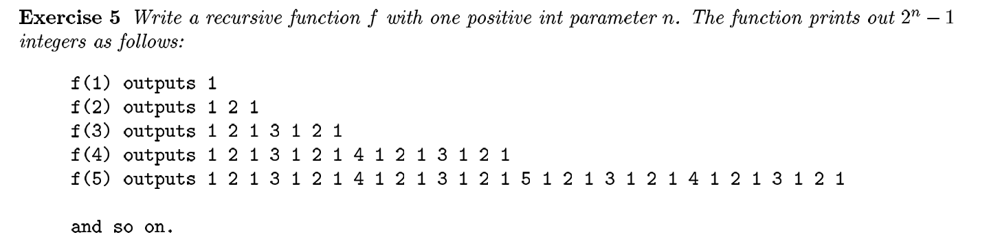

f(n):
    if n == 1
        print(1, end=' ')
    else
        f(n - 1)
        print(n, end=' ')
        f(n - 1)

Dry Run: 
f(3)
-> f(2), 3, f(2)
-> f(1), 2, f(1), 3, f(1), 2, f(1)
-> 1 2 1 3 1 2 1