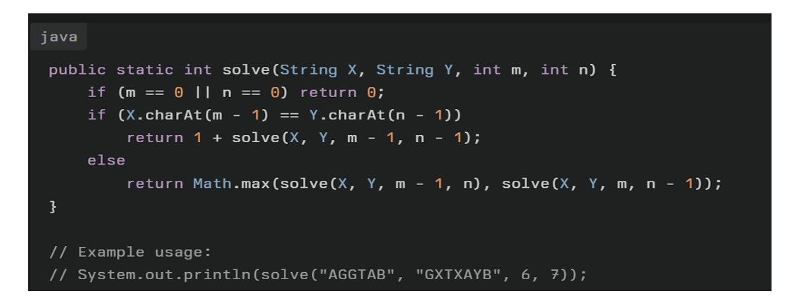

A. 2 
B. 3 
C. 4 
D. 5

Given two strings X and Y, find the length of the Longest Common Subsequence using standard recursion (Pick / Not Pick style).

int lcs(String X, String Y, int m, int n) {
    if (m == 0 || n == 0) return 0;

    if (X.charAt(m - 1) == Y.charAt(n - 1))
        return 1 + lcs(X, Y, m - 1, n - 1); // pick both
    else
        return Math.max(
            lcs(X, Y, m - 1, n),   // not pick from X
            lcs(X, Y, m, n - 1)    // not pick from Y
        );
}

X = "AGGTAB";
Y = "GXTXAYB";
lcs(X, Y, 6, 7); 

Final Answer: C. 4 (LCS-"GTAB")

