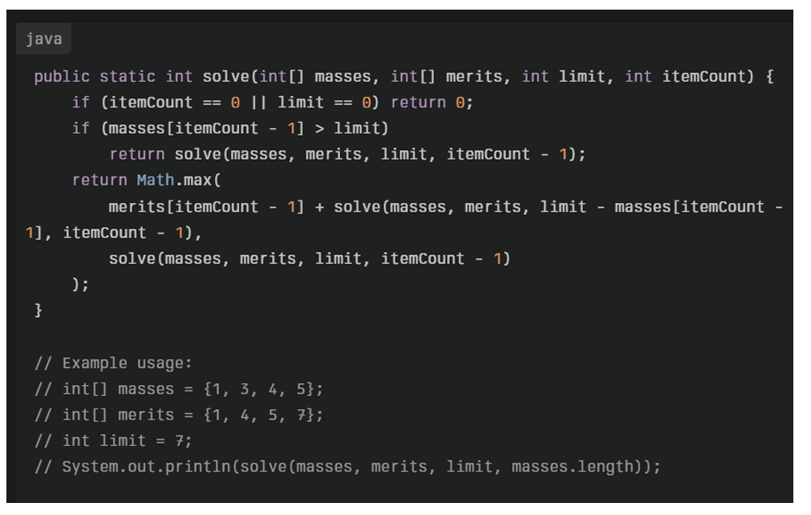

A. 7 
B. 8 
C. 9 
D. 6 

Solves the 0/1 Knapsack problem using recursion.

solve(int[] masses, int[] merits, int limit, int itemCount) {
    if (itemCount == 0 || limit == 0) return 0;
    if (masses[itemCount - 1] > limit)
        return solve(masses, merits, limit, itemCount - 1);
    return Math.max(
        merits[itemCount - 1] + solve(masses, merits, limit - masses[itemCount - 1], itemCount - 1),
        solve(masses, merits, limit, itemCount - 1)
    );
}

int[] masses = {1, 3, 4, 5};
int[] merits = {1, 4, 5, 7};
int limit = 7;

System.out.println(solve(masses, merits, limit, masses.length));

Final Answer: C. 9
